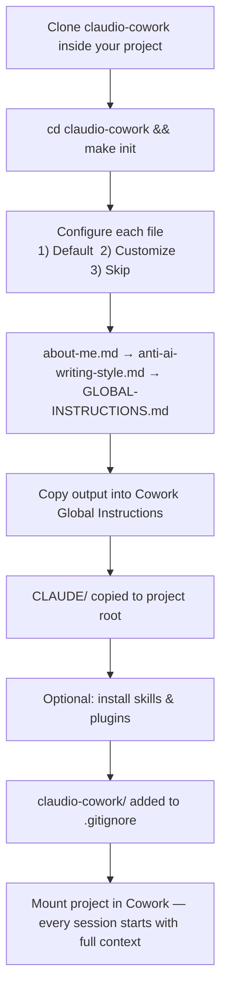
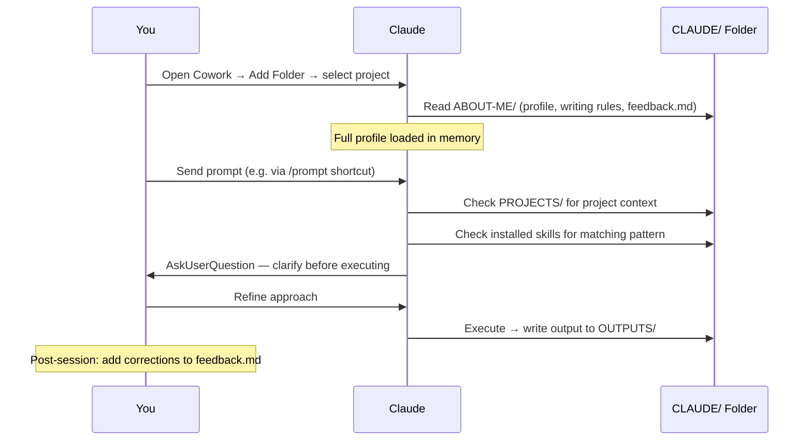
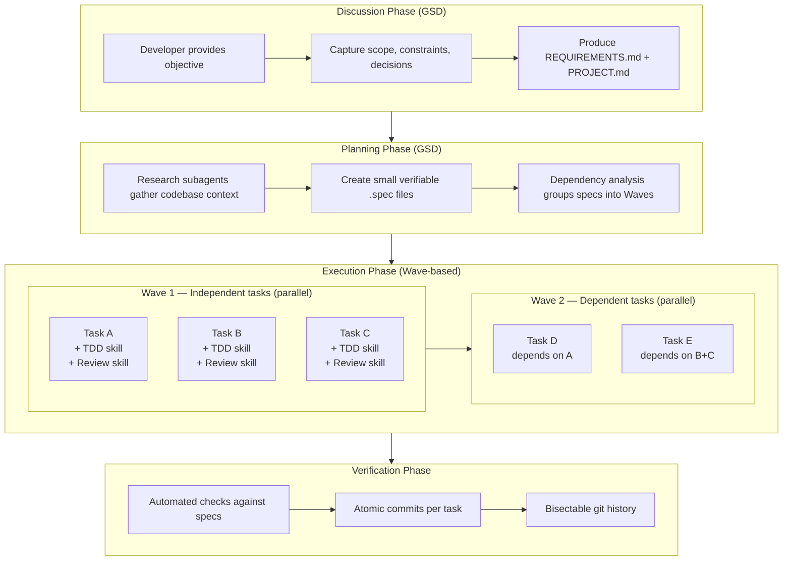
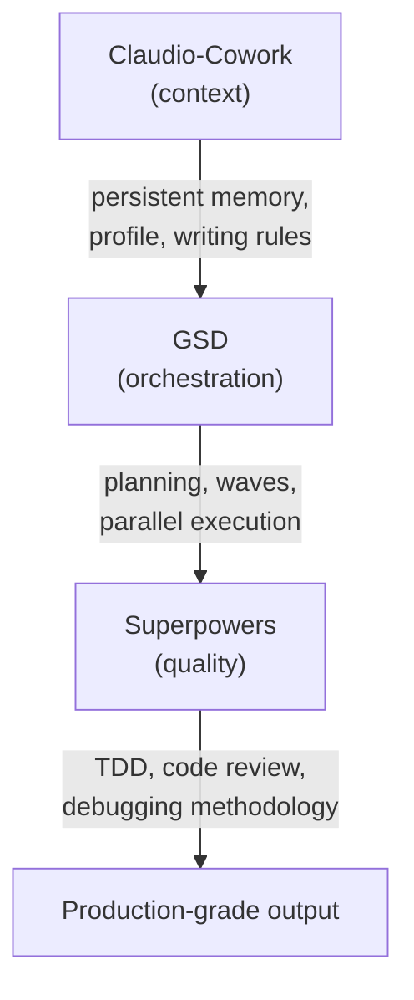
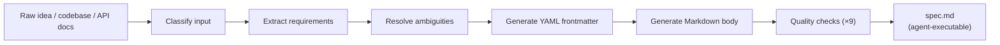

<p align="center">
  
</p>

<h1 align="center">Claudio-Cowork</h1>

<p align="center">
  Persistent memory and custom skills for <a href="https://claude.ai">Claude Cowork</a>.<br/>
  Clone it inside your project. Run <code>make init</code>. Claude configures everything and installs <code>CLAUDE/</code> into your project root.
</p>

<p align="center">
  <a href="HOW-TO.md">Setup Guide</a> &middot;
  <a href="HOW-TO.md#the-meta-prompt-generator-skill">Meta-Prompt Generator</a> &middot;
  <a href="#agent-orchestration">Agent Orchestration</a>
</p>

---

## The Problem

Claude Cowork starts every session with zero context about you. You re-explain your stack, re-correct the same writing habits, and re-describe your project conventions each time.

This repository eliminates that. Clone it inside your existing project, run `make init`, and Claude analyzes your project, builds your profile, configures everything interactively, installs the `CLAUDE/` directory into your project root, and packages and installs skills. The `claudio-cowork/` directory is automatically added to `.gitignore` so it stays local and is never committed.

---

## How It Works



Four mechanisms compound over time:

- **Static context** (`CLAUDE/ABOUT-ME/`) — your profile, stack, and communication preferences, read every session.
- **Dynamic corrections** (`feedback.md`) — one-line fixes that accumulate into a personalized fine-tuning layer.
- **Structural guardrails** (`CLAUDE/GLOBAL-INSTRUCTIONS.md`) — folder protocol, naming conventions, domain defaults.
- **Automated audit** (scheduled task) — weekly review of outputs against your standards, catching drift before it compounds.

The prompts stay simple. The context does the heavy lifting.

---

## The Session Lifecycle

Every Cowork session follows the same boot sequence, triggered by the Global Instructions you paste into Settings.



Without this system, every session is a blank slate. With it, Claude starts already knowing your stack, your writing preferences, your accumulated corrections, and your project context.

---

## What `make init` Produces

```
your-project/
├── .gitignore                            ← claudio-cowork/ entry added automatically
├── your existing files...
├── claudio-cowork/                       ← Stays local, git-ignored
│   ├── Makefile
│   ├── SKILLS/
│   ├── scripts/
│   └── ...
└── CLAUDE/                               ← Installed by make init
    ├── ABOUT-ME/                         ← Your profile, writing rules, correction log
    │   ├── about-me.md                   ← Generated from project analysis or your answers
    │   ├── anti-ai-writing-style.md      ← Default or customized during init
    │   └── feedback.md                   ← Running correction log
    ├── PROJECTS/                         ← Your briefs, references, data (per project)
    ├── OUTPUTS/                          ← Where Claude delivers work
    ├── GLOBAL-INSTRUCTIONS.md            ← Paste into Settings → Cowork
    └── PROMPT-TEMPLATE.md                ← Reusable prompt + Mac shortcut setup
```

---

## What's Inside CLAUDE/

| File | Purpose |
|------|---------|
| `ABOUT-ME/about-me.md` | Identity file — name, role, domains, tech stack, priorities, communication style. Claude reads this first to calibrate every output. |
| `ABOUT-ME/anti-ai-writing-style.md` | Kill list of AI writing patterns plus positive rules for tone, structure, and domain conventions. |
| `ABOUT-ME/feedback.md` | Running correction log. One line per fix. Read before every task, applied as overrides. Grows into a personalized fine-tuning layer. |
| `GLOBAL-INSTRUCTIONS.md` | Control plane. Folder protocol (read-only + write), naming conventions, domain defaults. Paste into Cowork settings. |
| `PROMPT-TEMPLATE.md` | Reusable prompt that forces context loading → clarification → execution. Includes Mac text shortcut setup. |
| `PROJECTS/` | Project-specific briefs, references, datasets, and finished work. One subfolder per project. |

---

## Agent Orchestration

For complex projects that need multi-agent coordination, `make plugins` installs the recommended agent stack: **GSD** (orchestration) + **Superpowers** (quality enforcement).

### How Orchestration Works

When plugins are enabled, development follows a structured pipeline. GSD decomposes work into small specs and executes them in parallel waves. Superpowers skills are injected into each subagent to enforce TDD and code review.



Each subagent gets a fresh 200K token context window — task 50 has the same quality as task 1. This solves the "context rot" problem where output quality degrades over long sessions.

### Responsibility Division

| Concern | Owner | Mechanism |
|---------|-------|-----------|
| Project decomposition | GSD | Discussion and planning phases |
| Dependency analysis | GSD | Wave-based execution groups |
| Parallel execution | GSD | Fresh subagent per task with isolated context |
| State persistence | GSD | `.planning/` directory with YAML frontmatter |
| Git strategy | GSD | Branch-per-slice, atomic commits |
| Cost visibility | GSD | Token tracking per phase/slice/model |
| Test-first discipline | Superpowers | TDD skill injected into execution subagents |
| Code review | Superpowers | Dual-stage review (spec compliance → code quality) |
| Debugging methodology | Superpowers | Systematic debugging skill when issues arise |
| Completion verification | Both | GSD verification phase + Superpowers review |

### How the Stack Fits Together



GSD handles orchestration: how to break a large objective into a dependency graph of tasks, execute them in parallel waves, and track cost. Superpowers handles discipline: how to ensure each task follows TDD, gets reviewed, and meets quality standards. Claudio-Cowork handles context: who you are, how you write, and what conventions your project follows.

Neither alone is sufficient. GSD without quality enforcement produces fast but brittle code. Superpowers without orchestration doesn't scale beyond single-task execution. The combination gives you an autonomous pipeline where orchestration is intelligent and individual execution is disciplined.

### Plugins Installation

```bash
make plugins
```

The command is idempotent — running it again skips already-installed components. GSD requires Node.js (`npx`). Superpowers requires the Claude CLI. If either dependency is missing, the command prints the manual install command instead of failing.

During `make init`, you're prompted to install plugins as part of the setup flow. You can also run `make plugins` independently at any time.

See the [agent framework evaluation](agent-framework-evaluation.md) for the full technical analysis behind this recommendation.

---

## The Meta-Prompt Generator

The most complex skill. It compiles unstructured input into deterministic, contract-grade agent specifications.



The skill classifies your input, extracts requirements through structured questions, generates a YAML frontmatter (single source of truth) with a Markdown body (examples, anti-patterns, implementation guidance), then runs 9 quality checks before delivering the spec.

Output format rationale — why YAML+Markdown over XML, structured Markdown, or flexible formats — is documented in the skill's `references/output-format-rationale.md`.

---

## Quick Start

```bash
# From inside your existing project directory:
git clone https://github.com/<your-username>/claudio-cowork.git
cd claudio-cowork
make init
```

`make init` runs a complete setup sequence:

1. **Install templates** — Copies `CLAUDE/` to your project root. Templates inside `claudio-cowork/` are never modified.
2. **`about-me.md`** — Select **1 (Context)** to auto-generate from project analysis, **2 (Customize)** for guided questions, or **3 (Skip)**.
3. **`anti-ai-writing-style.md`** — Select **1** for defaults, **2** to customize, or **3 (Skip)**.
4. **`GLOBAL-INSTRUCTIONS.md`** — Select **1** for defaults, **2** to customize, or **3 (Skip)**.
5. **Finalize** — Outputs `GLOBAL-INSTRUCTIONS.md` content (skipped sections excluded). Copy into **Settings → Cowork → Edit Global Instructions**.
6. **Install skills** — **1 (Yes)** or **2 (No)**. Run `make skills` later if skipped.
7. **Update `.gitignore`** — Adds `claudio-cowork/` automatically.
8. **Install plugins** — **1 (Yes)** or **2 (No)**. Run `make plugins` later if skipped.

Full walkthrough: [`HOW-TO.md`](HOW-TO.md)

---

## Methodology

Follows a "context over prompting" philosophy. Instead of crafting perfect prompts per task, give Claude persistent context.

This system was built for an engineering workflow, but the architecture is domain-agnostic. Fork it, replace the content, and it works for any domain.
